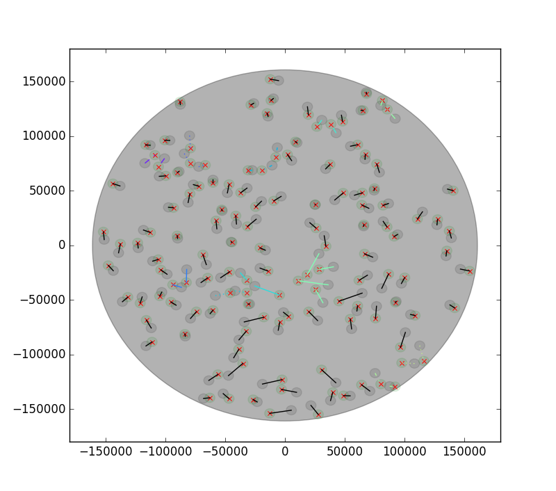

====================
TAIPAN Router Manual
====================

The TAIPAN router calculates the paths that the starbugs need to take to be
positioned in a given arrangement. 

The starting coordinates are the individual park positions as provided by the
locationProperties.json (S5). This file also contains the information on bug
availability allowing the identification of missing bugs. 

The target coordinates are specified in the XY tiles (S2). These tiles are
created from the Tiles (S1) that are generated by the tiler code. 

The step to convert S1 -> S2 is done by an external program creatively named S12S2.
This program uses the telescope model to convert RA/Dec coordinates to X/Y
positions in the focal plane. 

The output of the code is a Routed Tile (S3) with the necessary steps to move the bugs
into position without colliding. 

